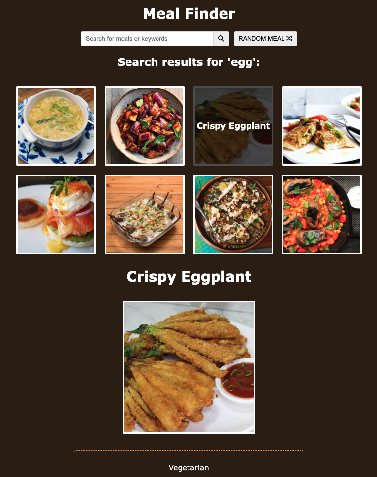
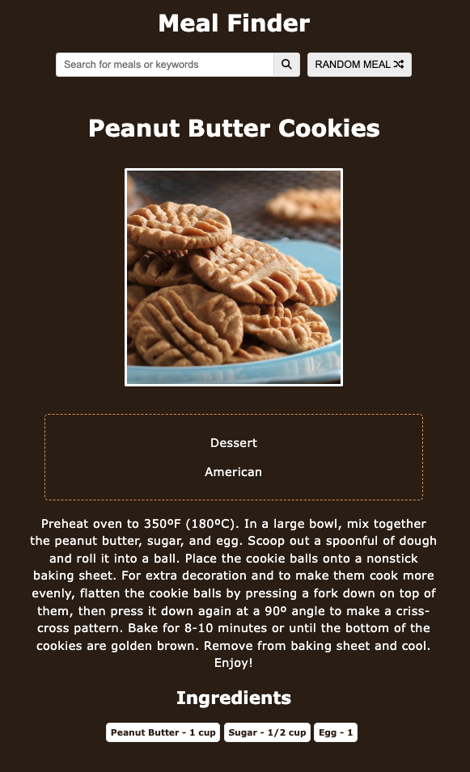

# meal-finder-dom-starter

### List of meals after typing search term. For instance, "egg":

### Click any meal listed in the list of meals will display selected meal info at the bottom

### RANDOM MEAL button clicked

